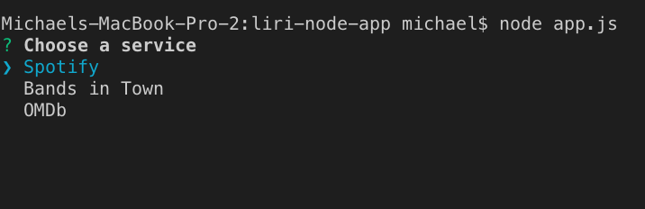
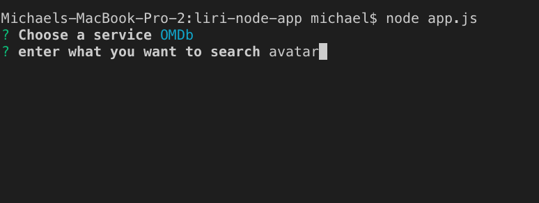
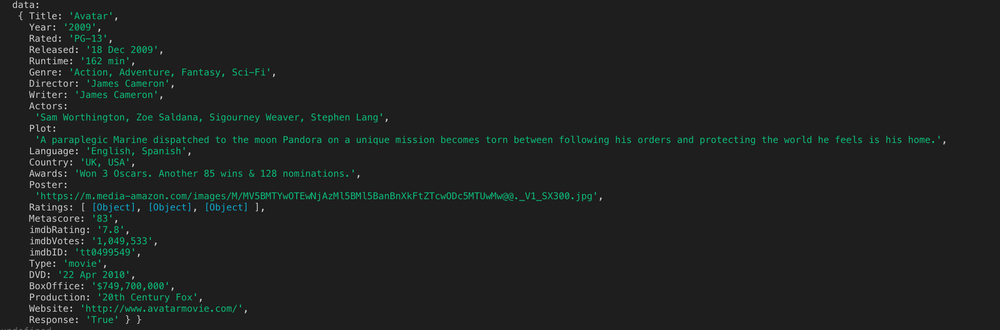

This app is called LIRI, just like iPhone's SIRI, but a little different at the same time. while SIRI is a Speech Interpretation and Recognition Interface, LIRI is a _Language_ Interpretation and Recognition Interface. LIRI will be a command line node app that takes in parameters and gives you back data.

It will let you select from Spotify, Bands in Town, and OMBD and make the api call with the search parameter you enter and give you back the data you want. **
**

